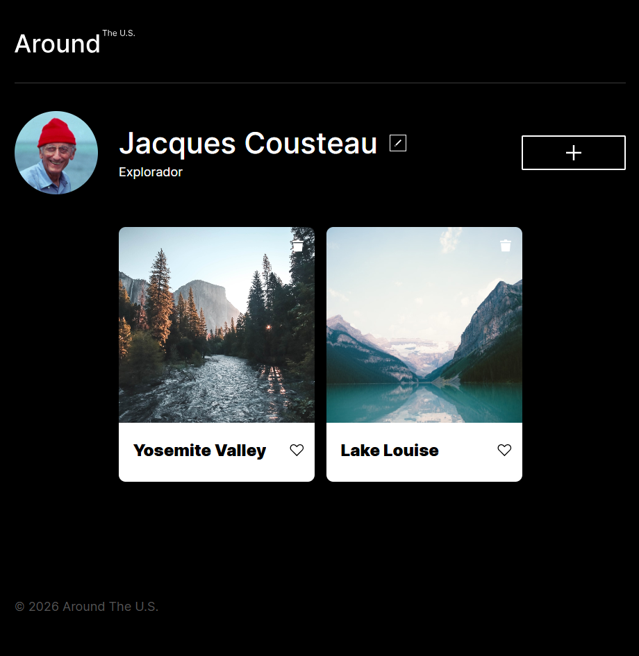

# Around The U.S. (React Application)

_Language / Idioma:_ [Español](#descripción-del-proyecto) | [English](#project-description)

**🔗 Ver el proyecto en vivo (live project):** (https://cencab.github.io/web_project_around_react/)

**🖥️ Vista Previa del Proyecto (Project Preview):**

---

## Descripción del Proyecto

Este proyecto es la evolución de la aplicación interactiva "Around The U.S.", migrada por completo desde una arquitectura imperativa en Vanilla JS hacia un entorno declarativo y moderno con **React** y **Vite**. El objetivo principal de esta fase de desarrollo fue refactorizar la interfaz de usuario dividiendo la maquetación en componentes independientes y reutilizables, controlando el flujo y la visibilidad de la interfaz de manera declarativa mediante el uso de Hooks (`useState`, `useEffect`) y optimizando el ciclo de vida de la aplicación.

## Funcionalidades

El sitio mantiene e incrementa sus capacidades interactivas bajo la filosofía de React:

- **Componentización Declarativa:** La interfaz de usuario completa (Header, Main, Footer) ha sido segmentada en componentes modulares independientes bajo la extensión `.jsx`.
- **Ventanas Emergentes Controladas (Popups):** Creación de un componente contenedor genérico (`Popup.jsx`) que aprovecha la propiedad `{children}` de React para renderizar de manera dinámica formularios reutilizables o vistas ampliadas.
- **Gestión de Estado Centralizada:** Implementación del hook `useState` dentro del componente `Main` para orquestar la apertura, inyección de contenido y el cierre de todos los modales (`EditProfile`, `NewCard`, `EditAvatar`).
- **Renderizado Dinámico de Galería:** Uso del método `.map()` sobre arreglos de datos ficticios (y posteriormente asíncronos) para proyectar componentes `<Card />` dinámicos, garantizando la optimización del DOM mediante llaves (`key`) únicas.
- **Lightbox Adaptativo (`ImagePopup`):** El componente contenedor se adapta dinámicamente mediante renderizado condicional; si no recibe un título, ajusta automáticamente sus clases de estilos CSS para proyectar la imagen a pantalla completa con su pie de foto.
- **Ciclo de Vida Limpio:** El desmontaje (_unmounting_) y la visibilidad de elementos interactivos son controlados directamente por React, previniendo fugas de memoria (_memory leaks_) sin necesidad de manipular escuchadores de eventos manuales.

## Tecnologías y Herramientas Utilizadas

- **React (v18+):** Biblioteca principal para la construcción de la interfaz mediante componentes funcionales y Hooks.
- **Vite:** Herramienta de construcción y entorno de desarrollo rápido de última generación encargado del empaquetado y hot-reload.
- **JSX:** Sintaxis extendida de JavaScript para la estructuración semántica y reactiva del marcado.
- **CSS3:** Estilos organizados bajo la estricta metodología **BEM** y diseño completamente responsivo adaptado para escritorio, tabletas y móviles.
- **ESLint:** Linter y motor de análisis estático configurado bajo los estándares de la industria para evaluar la calidad y la sintaxis limpia del código.

---

## Project Description

This project represents the complete evolution of the "Around The U.S." interactive application, fully migrated from an imperative Vanilla JS architecture into a modern, declarative environment using **React** and **Vite**. The primary objective of this development phase was to refactor the entire user interface by breaking the layout down into independent, reusable components, managing UI visibility workflows via Hooks (`useState`, `useEffect`), and optimizing application event lifecycles.

## Features

The application maintains and enhances its interactive capabilities under React's declarative philosophy:

- **Declarative Componentization:** The entire user interface (Header, Main, Footer) has been isolated into modular, independent `.jsx` files.
- **Controlled Reusable Modals (Popups):** Engineered a generic container component (`Popup.jsx`) that leverages React's `{children}` prop to dynamically render reusable forms or media views.
- **Centralized State Management:** Implemented the `useState` hook inside the `Main` component to seamlessly coordinate the opening, content injection, and closing workflow for all functional forms (`EditProfile`, `NewCard`, `EditAvatar`).
- **Dynamic Gallery Rendering:** Utilized the `.map()` array method over structured data objects to map dynamic `<Card />` components, strictly optimized through unique `key` props for DOM tree efficiency.
- **Adaptive Lightbox (`ImagePopup`):** The modal container dynamically morphs through conditional rendering; when missing a title prop, it automatically binds special CSS modifier classes to handle responsive, high-resolution full-screen media with custom text captions.
- **Clean Lifecycle Workflows:** Component unmounting and UI presence are managed natively by React's engine, effectively mitigating the risk of memory leaks without relying on manual global event listener dismantling.

## Architecture & Technologies Used

- **React (v18+):** Core UI library powered entirely by functional components and React Hooks.
- **Vite:** Next-generation frontend tooling providing lightning-fast dev server performance and streamlined production bundling.
- **JSX:** XML-like syntax extension to build reactive layout semantics inside JavaScript.
- **CSS3:** Layout formatting strictly organized under **BEM** methodology with full responsive support for Desktop, Tablet, and Mobile devices.
- **ESLint:** Static analysis tooling calibrated under strict quality guidelines to ensure standardized, high-quality code.
